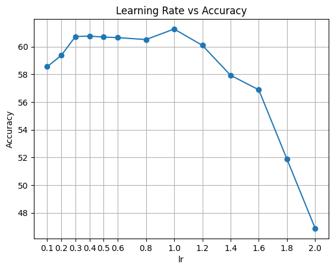

# Tiny-ImageNet reference training scripts

Scripts below are used to reproduce the results of Tiny-ImageNet experiments in README.md.

There are more tricks to improve the performance of the model, please refer to the [Torchvision ImageNet Training Scripts](https://pytorch.org/blog/how-to-train-state-of-the-art-models-using-torchvision-latest-primitives/) and make some adjustments for Tiny-ImageNet. For example, learning rate adjustment, the default `lr` value is set to 0.5.

<div align=left>

</div>

## Normal Training

Except otherwise noted, all models have been trained on 1x RTX4090/A100 GPU with the following parameters in [train_tiny.sh](script/train_tiny.sh):

| Parameter                | value               |
| ------------------------ | ------------------- |
| `--batch_size`           | `256`               |
| `--epochs`               | `100`               |
| `--lr`                   | `0.5`               |
| `--momentum`             | `0.9`               |
| `--wd`, `--weight-decay` | `1e-4`              |
| `--lr-scheduler`         | `cosineannealinglr` |

```
torchrun --nproc_per_node=1 imagenet/train.py \
    --model resnet18 \
    --batch-size 256 \
    --epochs 100 \
    --lr-scheduler cosineannealinglr \
    --data-path /home/zeyuan.yin/imagenet \
    --output-dir ./save/tiny/resnet18 \
    --dataset tiny-imagenet
```

## Knowledge Distillation

Except otherwise noted, all models have been trained on 1x RTX4090 GPU with the following parameters in [train_kd_tiny.sh](script/train_kd_tiny.sh):

| Parameter                    | value               |
| ---------------------------- | ------------------- |
| `--batch_size`               | `256`               |
| `--epochs`                   | `100`               |
| `--lr`                       | `0.5`               |
| `--momentum`                 | `0.9`               |
| `--wd`, `--weight-decay`     | `1e-4`              |
| `--lr-scheduler`             | `cosineannealinglr` |
| `--distillation-type`        | `soft`              |
| `--distillation-alpha`       | `0.5`               |
| `--distillation-temperature` | `10`                |

```
torchrun --nproc_per_node=1 imagenet/train.py \
    --model resnet18 \
    --batch-size 256 \
    --epochs 100 \
    --lr-scheduler cosineannealinglr \
    --data-path /home/zeyuan.yin/imagenet \
    --output-dir ./save_kd/tiny/resnet18 \
    --dataset tiny-imagenet \
    --teacher-model resnet18 --distillation-type soft
```
